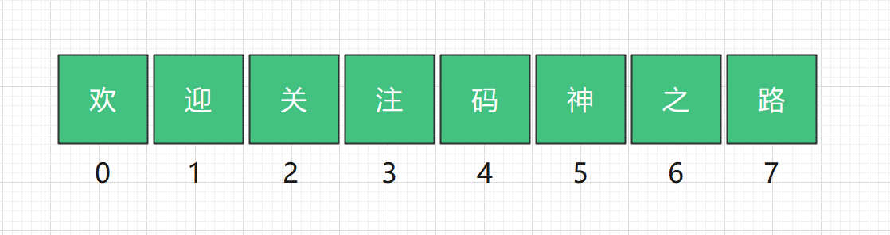
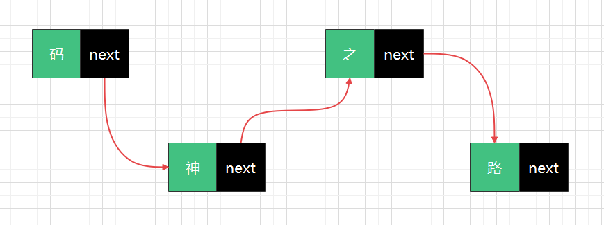
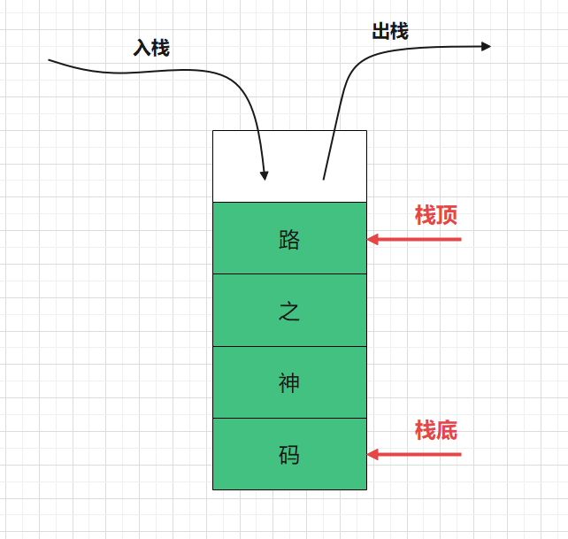
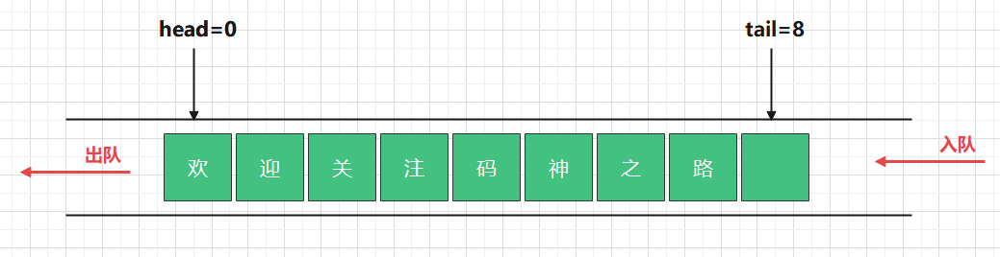
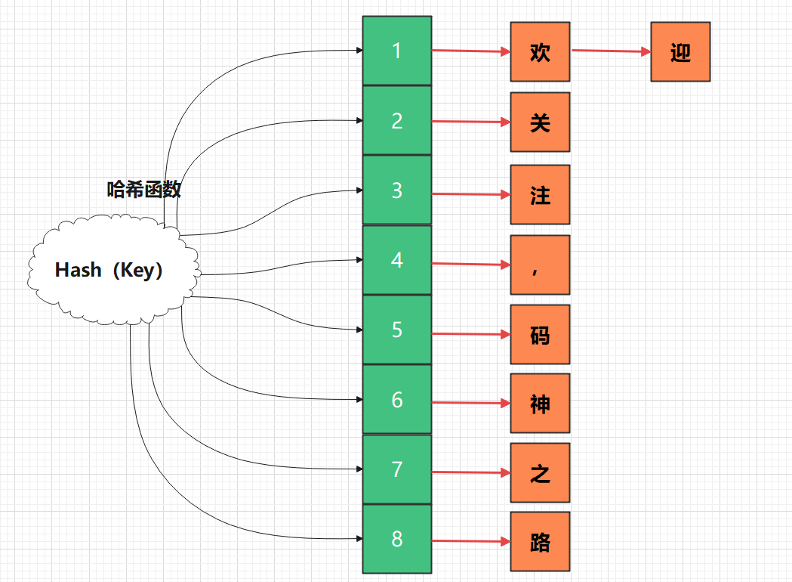
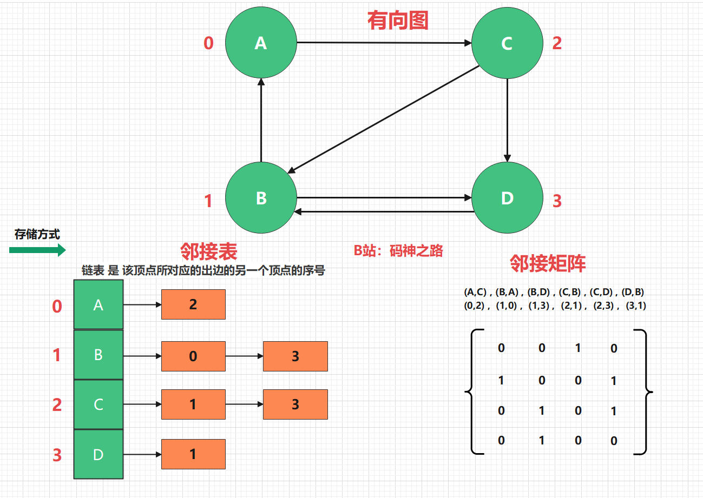
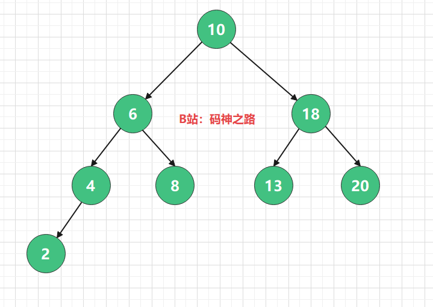
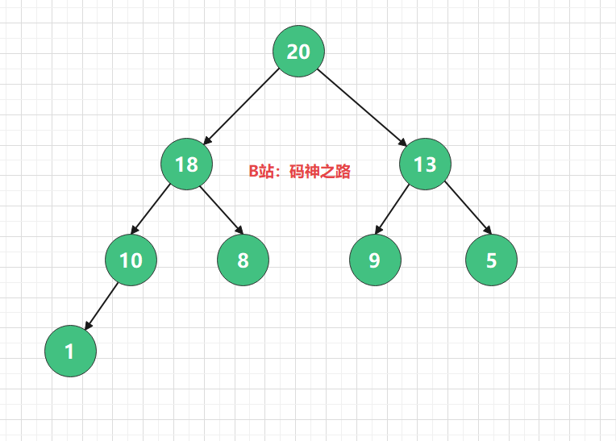

# 前言

> 底层基础决定上层建筑，数据结构与算法就是基石之一。

> CPU，内存，磁盘这是计算机三个重要的部件。
>
> `CPU`负责运算(计算)。
>
> `内存`和`磁盘`属于数据媒介，负责`存储`并提供数据。
>
> 数据存储，需要有载体，这个载体，我们称之为`数据结构`

**JVM是运行在内存中，所以这里的存储媒介我们讲的是内存**

# 1. 数组

> `数组`是一组`连续内存空间`存储的具有`相同类型`的数据，是一种`线性结构`。

`优势是什么？`

1. `类型固定`: 意味着长度固定
2. `连续内存空间`
3. 因为上述两点特性，基于初始地址，可以计算数组任意位置的内存地址，所谓的`查询快`
4. `随机访问`：通过下标直接访问，即访问第N个元素，不需要访问前(N-1)个数据
5. `顺序存储`：在内存中按顺序存放

`劣势是什么?`

1. 数据初始化需要连续的内存空间，数据在内存当中是随机存放的，不一定有指定长度的连续空间
2. 当插入数据的时候，为了保持连续性，需要做数据迁移（想想如果，添加一个数据，需要向后移动一位，但是如果这一位被其他数据占用了，那么整个数组都需要进行迁移，找到能存放下的内存空间）
3. 同样的道理，删除的时候，也需要做数据迁移

**注意事项：尽量在数组初始化的时候，就确定其大小，数组适合读多的场景**

## 1.1 实现

~~~xml
<properties>
        <maven.compiler.source>1.8</maven.compiler.source>
        <maven.compiler.target>1.8</maven.compiler.target>
        <maven.compiler.compilerVersion>1.8</maven.compiler.compilerVersion>
        <encoding>UTF-8</encoding>
    </properties>
~~~

~~~java
package com.mszlu.alg.structs;

import java.util.Arrays;
import java.util.Iterator;

public class MsArrayList<E> implements Iterable<E> {

    private Object[] elementData;
    public MsArrayList(int capacity){
        //初始化 设定容量
        elementData = new Object[capacity];
    }

    public boolean add(E element){
        //添加的时候 往尾部追加
        int size = elementData.length;
        //需要进行扩容，这里只增加一个元素，扩容+1，实际上应该扩容2倍，防止频繁扩容
        int newCapacity = size + 1;
        elementData = Arrays.copyOf(elementData, newCapacity);
        elementData[size] = element;
        return true;
    }

    public E get(int index){
        return (E) elementData[index];
    }

    public int size(){
        return elementData.length;
    }

    public E set(int index,E element){
        int size = elementData.length;
        if (index > size - 1){
            throw new IndexOutOfBoundsException();
        }
        E oldElement = (E) elementData[index];
        elementData[index] = element;
        return oldElement;
    }

    public static void main(String[] args) {
        MsArrayList<String> msArrayList = new MsArrayList<>(10);
        msArrayList.set(0,"1");
        msArrayList.add("11");
        msArrayList.forEach(s -> {
            System.out.println(s);
        });

    }

    @Override
    public Iterator<E> iterator() {
        return new MsIterator();
    }

    class MsIterator implements Iterator<E>{
        int index = 0;
        @Override
        public boolean hasNext() {
            return index != elementData.length;
        }

        @Override
        public E next() {
            return (E) elementData[index++];
        }
    }
}

~~~

# 2. 链表

> 链表一种`非连续`、`非顺序`的存储结构，由一系列节点组成，节点间通过`指针完成了串联`，每个节点包含`数据`和`下一个节点指针`两部分。
>

根据指针的方向可以分为：

- 单向链表
- 循环链表
- 双向链表
- 双向循环链表

`优势是什么？`

1. 不需要连续空间，较灵活
2. `随机存储`：非顺序存储
3. 插入，删除时，只需要更改指针指向即可，开销小

`劣势是什么？`

1. 每个节点除了存储数据，还存储指针，占用额外的空间
2. `顺序存取`：存取第N个数据时，必须先访问前(N-1)个数据，效率低

**链表适合写多的场景**

## 2.1 实现

~~~java
package com.mszlu.alg.structs;

import java.util.Iterator;

public class MsLinkedList<E> implements Iterable<E> {

    private int size;
    private Node<E> first;
    private Node<E> last;

    @Override
    public Iterator<E> iterator() {
        return new MyIterator();
    }
    class MyIterator implements Iterator<E>{
        int index;
        @Override
        public boolean hasNext() {
            return index != size;
        }

        @Override
        public E next() {
            return get(index++);
        }
    }

    private static class Node<E>{
        E item;
        Node<E> prev;
        Node<E> next;

        Node(Node<E> prev,E item,Node<E> next){
            this.prev = prev;
            this.item = item;
            this.next = next;
        }
    }

    public void addLast(E element){
        final Node<E> l = last;
        Node<E> newNode = new Node<>(l,element,null);
        last = newNode;
        if (l == null){
            first = newNode;
        }else{
            l.next = newNode;
        }
        size++;
    }

    public E set(int index, E element){
        Node<E> x = node(index);
        E oldValue = x.item;
        x.item = element;
        return oldValue;
    }

    private Node<E> node(int index) {
        if (index < (size << 1)){
            Node<E> x = first;
            for (int i = 0;i<index;i++){
                x = x.next;
            }
            return x;
        }else{
            Node<E> x = last;
            for (int i = size - 1;i>index;i--){
                x = x.prev;
            }
            return x;
        }
    }

    public E get(int index){
        return node(index).item;
    }

    public static void main(String[] args) {
        MsLinkedList<String> msLinkedList = new MsLinkedList<>();
        msLinkedList.addLast("1");
        msLinkedList.addLast("2");
        msLinkedList.addLast("3");
        msLinkedList.set(1,"set");
        System.out.println(msLinkedList.get(1));
        msLinkedList.forEach(s -> {
            System.out.println(s);
        });
    }
}

~~~

# 3. 栈

> 又名`堆栈`，限定仅在`表尾进行插入和删除`操作的`线性表`（把所有数据用一根线儿串起来，再存储到物理空间中）。
>
> 上面成为`栈顶`，下面称为`栈底`。
>
> 向栈插入新元素称为`入栈`，新元素放到栈顶；从一个栈删除元素又称作`出栈`，它是把栈顶元素删除掉，使其下面相邻的元素成为新的栈顶元素。

根据底层结构不同，可以分为：

1. `数组实现的顺序栈`
2. `链表实现的链式栈`

`优势是什么？`

1. 先进后出，后进先出
2. 只能操作栈顶元素，可控性好，适合特殊场景

`劣势是什么?`

1. 只能操作栈顶元素

`应用场景`

1. JVM的本地方法栈，函数调用
2. 浏览器的前进、后退

## 3.1 实现

数组实现的顺序栈：

~~~java
package com.mszlu.alg.structs;

import java.util.Arrays;

public class ArrayStack<E> {

    private Object[] elementData;

    private int topIndex;

    public ArrayStack(int capacity){
        elementData = new Object[capacity];
    }

    /**
     * 入栈
     * @return
     */
    public boolean push(E element){
        if (topIndex >= elementData.length){
            int newCapacity = elementData.length << 1;
            elementData = Arrays.copyOf(elementData,newCapacity);
        }
        elementData[topIndex++] = element;
        return true;
    }

    /**
     * 出栈 并且删除栈顶元素
     * @return
     */
    public E pop(){
        if (topIndex <= 0){
            throw new RuntimeException("栈为空");
        }
        return (E) elementData[--topIndex];
    }

    /**
     * 出栈
     * @return
     */
    public E peek(){
        if (topIndex <= 0){
            throw new RuntimeException("栈为空");
        }
        return (E) elementData[topIndex-1];
    }

    public static void main(String[] args) {
        ArrayStack<String> arrayStack = new ArrayStack<>(10);
        arrayStack.push("1");
        arrayStack.push("2");
        arrayStack.push("3");

        System.out.println(arrayStack.pop());
        System.out.println(arrayStack.pop());
        System.out.println("--------------");
        System.out.println(arrayStack.peek());
    }
}

~~~

链表实现的链式栈:

~~~java
package com.mszlu.alg.structs;

public class LinkedStack<E> {

    public static class Node<E>{
        E item;
        Node<E> next;

        public Node(E item, Node<E> next){
            this.item = item;
            this.next = next;
        }
    }

    private Node<E> header;
    private int elementCount;

    public boolean push(E element){
        header = new Node<>(element,header);
        elementCount++;
        return true;
    }

    public E pop(){
        if (header == null){
            throw  new RuntimeException("栈为空");
        }
        E item = header.item;
        //删除栈顶元素
        header = header.next;
        elementCount--;
        return item;
    }

    public E peek(){
        if (header == null){
            throw  new RuntimeException("栈为空");
        }
        return header.item;
    }

    public static void main(String[] args) {
        LinkedStack<String> linkedStack = new LinkedStack<>();
        linkedStack.push("1");
        linkedStack.push("2");
        linkedStack.push("3");
        System.out.println("-------------");
        String pop = linkedStack.pop();
        System.out.println("pop:"+pop);
        String peek = linkedStack.peek();
        System.out.println("peek:"+peek);

    }
}

~~~

# 4. 队列

> `队列`是一种特殊的`线性表`，只允许在表的前端进行读取删除操作，而在表的后端进行插入操作。
>
> 和栈一样，队列是一种操作受限制的线性表。
>
> `插入`的数据放在`队尾`，`读取数据`的端称为`队头`。
>
> 队列中没有元素时，称为空队列。

根据底层结构不同，可以分为：

1. `数组实现的顺序队列`
2. `链表实现的链式队列`

根据支持的高级特性，还有以下队列：

1. 循环队列
2. 双端队列
3. 阻塞队列
4. 非阻塞队列

`优势是什么？`

1. 先进先出
2. 规则固定，可控性好，适合特殊场景

`劣势是什么?`

1. 不能直接操作队列中间的元素

`场景举例`

1. 限流
2. 线程池，来不及处理的任务会放入任务队列
3. Kafka，RocketMQ等代表的消息中间件

## 4.1 实现

数组实现：

~~~java
package com.mszlu.alg.structs;

import java.util.Arrays;

public class ArrayQueue<E> {

    private int head;

    private int tail;

    private Object[] elementData;

    public ArrayQueue(int capacity){
        elementData = new Object[capacity];
    }

    /**
     * 入队
     * @param element
     * @return
     */
    public boolean enQueue(E element){
        if (tail >= elementData.length){
            elementData = Arrays.copyOf(elementData,elementData.length << 1);
            if (head != 0){
                //进行一次数据迁移
                if (tail - head >= 0) System.arraycopy(elementData, head, elementData, 0, tail - head);
                tail = tail - head;
                head = 0;
            }
        }
        elementData[tail++] = element;
        return true;
    }

    public E deQueue(){
        if (head == tail){
            throw new RuntimeException("队列为空");
        }
        return (E) elementData[head++];
    }

    public static void main(String[] args) {
        ArrayQueue<String> arrayQueue = new ArrayQueue<>(3);
        arrayQueue.enQueue("1");
        arrayQueue.enQueue("2");
        arrayQueue.enQueue("3");
        System.out.println("---------------------");
        System.out.println(arrayQueue.deQueue());
        arrayQueue.enQueue("4");
        System.out.println(arrayQueue.deQueue());
        System.out.println(arrayQueue.deQueue());
        System.out.println(arrayQueue.deQueue());
        System.out.println("---------------------");
    }
}

~~~

链表实现：

~~~java
package com.mszlu.alg.structs;

public class LinkedQueue<E> {

    private static class Node<E>{
        E item;
        Node<E> next;
        public Node(E item, Node<E> next){
            this.item = item;
            this.next = next;
        }
    }
    private Node<E> head;
    private Node<E> tail;
    private int size;
    public LinkedQueue(){

    }

    public boolean enQueue(E element){
        Node<E> newNode = new Node<>(element,null);
        if (tail == null){
            tail = newNode;
            head = tail;
            return true;
        }
        tail.next = newNode;
        tail = newNode;
        return true;
    }

    public E deQueue(){
        if (head == null){
            throw new RuntimeException("队列为空");
        }
        E item = head.item;
        head = head.next;
        return item;
    }

    public static void main(String[] args) {
        LinkedQueue<String> arrayQueue = new LinkedQueue<>();
        arrayQueue.enQueue("1");
        arrayQueue.enQueue("2");
        arrayQueue.enQueue("3");
        System.out.println("---------------------");
        System.out.println(arrayQueue.deQueue());
        arrayQueue.enQueue("4");
        System.out.println(arrayQueue.deQueue());
        System.out.println(arrayQueue.deQueue());
        System.out.println(arrayQueue.deQueue());
        System.out.println("---------------------");
    }
}

~~~

# 5. 哈希表

> 哈希表（Hash table）也叫散列表。
>
> 根据`键（Key）`而`直接访问`在内存储存位置的数据结构。
>
> 它通过把关键码值映射到表中一个位置来访问记录，以加快查找的速度。
>
> 这个映射函数称为`散列函数`，存放记录的数组称做`散列表`。
>
> 常见的`散列(哈希)函数`有`MD5`、`SHA`、`CRC`等

`优势是什么?`

1. 将数据有效的做了切分，分而治之
2. 通过Key可以直接获取到要查找的数据，查询效率高

`劣势是什么?`

1. 可能存在hash冲突

> 如果有HASH冲突，那么在冲突的位置，将数据构建为链表结构，极端情况下，HASH表可能会退化为链表，所有元素都被存储在同一个节点的链表中。O(n)
>
> `装载因子=哈希表中的元素个数 / 哈希表长度`，如果装载因子过大，说明链表的长度越长，性能越低，哈希表需要进行扩容，将数据迁移到新的哈希表中。

`场景举例：`

1. Redis
2. HashMap

## 5.1 实现

~~~java
package com.mszlu.alg.structs.hash;

import org.w3c.dom.Node;

public class MsHashTable<K,V> {

    //散列表 数组结构 (每一个元素上 是一个链表结构)
    private Node<K,V>[] table;

    private static class Node<K,V>{
        //hash函数计算的结果
        final int hash;
        final K key;
        V value;
        Node<K,V> next;

        public Node(int hash,K key,V value,Node<K,V> next){
            this.hash = hash;
            this.key = key;
            this.value = value;
            this.next = next;
        }
    }

    public MsHashTable(int capacity){
        table = (Node<K, V>[]) new Node[capacity];
    }

    public void put(K key,V value){
        //1. 计算hash值
        int hash = hash(key);
        int i = (table.length - 1) & hash;
        Node<K,V> node = new Node<>(hash,key,value,null);
        Node<K, V> kvNode = table[i];
        if (kvNode == null){
            //这个数组位置 没有数据 是第一个
            table[i] = node;
            return;
        }
        //数组位置有值
        //需要判断一下key是否相等，key相等的情况下 进行替换
        if (kvNode.key.equals(key)){
            kvNode.value = value;
        }else{
            kvNode.next = node;
        }
    }

    public V get(K key){
        int hash = hash(key);
        int i = (table.length - 1) & hash;
        Node<K, V> node = table[i];
        if (node == null){
            return null;
        }
        Node<K, V> newNode = node;
        //正常 做一个循环，查找key是否匹配，知道next为null
        while (newNode.next != null){
            if (newNode.key.equals(key)){
                break;
            }
            newNode = newNode.next;
        }
        return newNode.value;
    }

    static final int hash(Object key) {
        int h;
        return (key == null) ? 0 : (h = key.hashCode()) ^ (h >>> 16);
    }

    public static void main(String[] args) {
        MsHashTable<String,String> hashTable = new MsHashTable<>(10);
        hashTable.put("key1","mszlu1");
        hashTable.put("key2","mszlu2");
        hashTable.put("key1","mszlu3");

        System.out.println(hashTable.get("key1"));
        System.out.println(hashTable.get("key2"));
    }
}

~~~

# 6. 图

> 图(Graph)是由顶点的有穷非空集合和顶点之间的集合组成，通常表示为：`G（V, E）`，其中 `G 表示一个图`，`V 是图 G 中顶点的集合`，`E 是图 G 中边的集合`。
>

根据图是否有方向、权重等可以分为:

1. 有向图
2. 无向图
3. 带权图

**图主要有以下两种存储方式：**

1. 邻接矩阵。比较浪费空间，但是优点是查询效率高
2. 邻接表。每个顶点对应一个链表，比较节省存储空间，但是查询效率会低些。当然为了提高查询效率，可以将里面的链表替换成红黑树、跳表、或者平衡二叉树。

`优势是什么？`

1. 任意点都可以建立关系，存储的数据量大（信息完备）
2. 可以描述两个顶点之间的关系，称之为`边`

`劣势是什么？`

1. 存储数据量大
2. 图用多维数组表示，将图运算转换为矩阵运算，较为复杂
3. 图稀疏的话，采用邻接表，节省空间

`场景举例：`

1. 地图如何计算出最优出行路线
2. 深度优先搜索
3. 广度优先搜索
4. 最小生成树

**相关术语：**

1. **出度**：由某个顶点指出的边的个数；
2. **入度**：指向某个顶点的边的个数；
3. **有向路径**：由一系列顶点组成，其中的每个顶点都存在一条有向边，从它指向序列中的下一个顶点
4. **有向环**：至少含有一条边，且起点和终点相同的有向路径

## 6.1 实现

**两个顶点v和w可能存在的4种关系：**

1. 没有边相连
2. 存在从v到w的边v->w
3. 存在从w到v的边w->v
4. 既存在v->w，也存在w->v，即双向连接

~~~java
package com.mszlu.alg.structs;

public class MsGraph {

    //顶点集合
    private char[] vertex;
    //邻接矩阵
    private int[][] matrix;

    /**
     *
     * @param vexs 顶点数组 {A,B,C,D}
     * @param edges 边数组 {{A,C},{B,A},{B,D},{C,B},{C,D},{D,B}}
     */
    public MsGraph(char[] vexs,char[][] edges){
        int vLen = vexs.length;
        int eLen = edges.length;
        //初始化顶点
        vertex = new char[vLen];
        System.arraycopy(vexs, 0, vertex, 0, vLen);
        //初始化边
        matrix = new int[vLen][vLen];
        for (int i =0;i<eLen;i++){
            //边的起始顶点和结束顶点
            int p1 = getPosition(edges[i][0]);
            int p2 = getPosition(edges[i][1]);
            matrix[p1][p2] = 1;
        }

    }

    public void print(){
        for (int i=0;i<vertex.length;i++){
            for (int j=0;j<vertex.length;j++){
                System.out.printf("%d ",matrix[i][j]);
            }
            System.out.printf("\n");
        }
    }
    private int getPosition(char ch) {
        for (int i = 0;i<vertex.length;i++) {
            if (vertex[i] == ch){
                return i;
            }
        }
        return -1;
    }

    public static void main(String[] args) {
        char[] vexs = {'A','B','C','D'};
        //{{A,C},{B,A},{B,D},{C,B},{C,D},{D,B}}
        char[][] edges = {
                {'A','C'},
                {'B','A'},
                {'B','D'},
                {'C','B'},
                {'C','D'},
                {'D','B'}
        };
        MsGraph msGraph = new MsGraph(vexs,edges);
        msGraph.print();
    }
}

~~~

# 7. 树

> 树是N (N >= 0 )个节点的有限集合,N = 0 时,称为空树。
>
> 树上的每一个元素称为节点，节点与节点之间有一定的关系，上下称为`父子节点`，左右称为`兄弟节点`。

按照树的表现结构，可以具体分为以下几种类型：

1. 二叉树
2. 平衡二叉树
3. 满二叉树
4. 完全二叉树
5. 递归树
6. 红黑树
7. B- 树
8. B+ 树

**每个节点包含：数据值，左子节点指针，右子节点指针**

`优势是什么？`

1. 树形结构，支持数据的快速插入、查找、删除
2. 支持多种遍历方式：前序遍历（根左右）、中序遍历（左根右）、后序遍历（左右根）
3. 结构特殊，适合用递归来实现

`劣势是什么?`

1. 删除节点麻烦
2. 删除节点-物理删除，需要重新构造树结构
3. 删除节点-逻辑删除，产生内存碎片

## 7.1 实现

~~~java
package com.mszlu.alg.structs;

public class Tree<E> {

    E item;
    Tree<E> left;
    Tree<E> right;

    public Tree(E item){
        this.item = item;
    }

    public Tree<E> buildLeft(E item){
        this.left = new Tree<>(item);
        return this.left;
    }

    public Tree<E> buildRight(E item){
        this.right = new Tree<>(item);
        return this.right;
    }

    public void printPreOrder(){
        System.out.print(this.item + ">");
        print(this.left);
        print(this.right);
    }
    public void print(Tree<E> node){
        if (node == null) return;
        System.out.print(node.item + ">");
        print(node.left);
        print(node.right);
    }

    public static void main(String[] args) {
        Tree<Integer> root = new Tree<>(10);
        Tree<Integer> left = root.buildLeft(6);
        Tree<Integer> left1 = left.buildLeft(4);
        left1.buildLeft(2);
        left.buildRight(8);
        Tree<Integer> right = root.buildRight(18);
        right.buildLeft(13);
        right.buildRight(20);
        root.printPreOrder();
    }
}

~~~

# 8. 堆

> 一种特殊的二叉树。需要满足两个条件：
>
> 1. 是一棵完全二叉树 
> 2. 堆中每个节点的值必须>=或<=其左右子节点的值。

根据每个节点的值是>= 还是 <= 子树中每个节点的值，分为

1. 大顶堆
2. 小顶堆

**节点的值只能比左右子节点，大或者小 只能选择一个**

`优势是什么？`

1. 时间复杂度较低
2. 获取堆顶元素的时间复杂度为 O(1)
3. 假设完全二叉树包含n个节点，插入元素、删除元素，时间复杂度为 O(logn)

`劣势是什么？`

1. 特殊的二叉树，只能用于特定场景

`场景举例：`

1. 堆排序
2. 优先级队列
3. 求 TOP K
4. 求中位数

## 8.1 实现

~~~java
package com.mszlu.alg.structs;

import java.util.PriorityQueue;

public class HeapNode {

    private int[] heap;
    private int size;

    public  HeapNode(int capacity){
        heap = new int[capacity];
    }

    public void offer(int n){
        int i = size;
        while (i > 0){
            int parent = (i-1) >>> 1;
            int v = heap[parent];
            if (n >= v){
                break;
            }
            heap[i] = v;
            i = parent;
        }
        heap[i] = n;
        size++;
    }

    public int poll(){
        //将堆顶元素 弹出，并且删除
        //需要重新构建堆
        int top = heap[0];
        int[] newHeap = new int[size-1];
        System.arraycopy(heap,1,newHeap,0,size-1);
        heap = new int[heap.length];
        size=0;
        for (int i : newHeap) {
            offer(i);
        }
        return top;
    }

    public int peek(){
        return heap[0];
    }

    public static void main(String[] args) {
        HeapNode heapNode = new HeapNode(6);
        heapNode.offer(4);
        heapNode.offer(3);
        heapNode.offer(6);
        heapNode.offer(2);
        heapNode.offer(9);
        heapNode.offer(7);
        System.out.println(heapNode.peek());
        System.out.println(heapNode.poll());
        heapNode.offer(1);
        System.out.println(heapNode.peek());
    }
}

~~~

**示例：从10亿个数据中找到最大的前10个？**

- 假设10亿个数据存在数组中
- 取前10个数据，构建一个小顶堆，那么根节点是最小的
- 然后，从数组中依次取出一个数据与堆顶比较，如果大于，替换掉堆顶元素，堆内部调整；如果小于等于堆顶，不做处理
- 同样逻辑，依次循环处理数组中每一个元素。
- 当10亿个数据处理完后，堆中的数据就是Top 10

~~~java
package com.mszlu.alg.structs;

import java.util.ArrayList;
import java.util.List;

public class HeapTopK {

	public static void main(String[] args) {
		int[] nums = new int[]{1,5,4,2,3,6};
		System.out.println(topKMax(nums, 5));	//输出：[2, 3, 4, 5, 6]
	}
	
	//寻找前k个最大的数--使用小顶堆
	public static List<Integer> topKMax(int[] nums, int k){
		//寻找前k个最小数，因此将小顶堆大小定义为k
		HeapNode pq = new HeapNode(k);
		for(int i=0; i<nums.length; i++){
			if(i<k){
				pq.offer(nums[i]);	//前k个数，直接入堆
			}else if(nums[i]>pq.peek()){	//如果当前元素比堆顶元素大
				pq.poll();	//说明堆顶元素（堆中最小元素）一定不属于前k大的数，出堆
				pq.offer(nums[i]);	//当前元素有可能属于前k大，入堆
			}
		}
		
		List<Integer> ans = new ArrayList<>();
		while(!pq.isEmpty()){
			ans.add(pq.poll());
		}
		return ans;
	}
}

~~~

