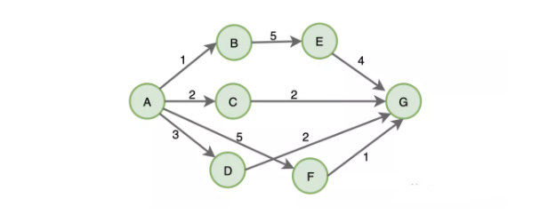
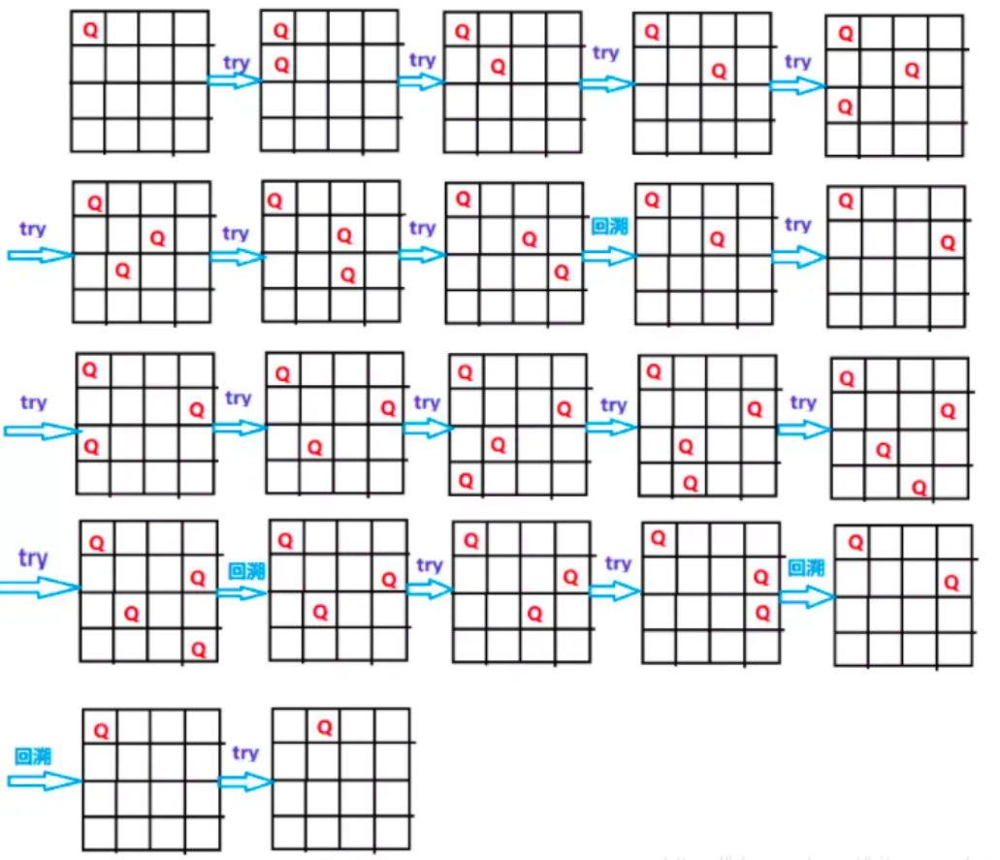
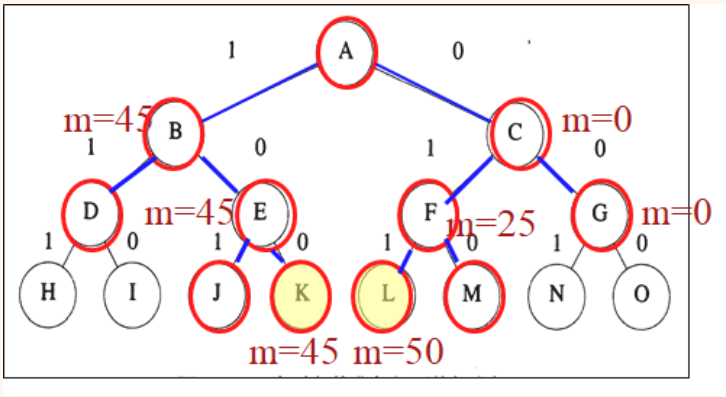

> `算法思想`是解决算法问题的核心，而大部分的算法解析思路都来源于以下的`七种算法策略`。
>
> 也就是说，掌握了下面的算法思想，那么就掌握了解题的基本套路

# 1. 递归

> 递归算法是一种直接或者间接`调用自身函数`或者方法的算法。
>
> 递归算法的实质是把`问题分解成规模缩小的同类问题`的`子问题`，然后递归调用方法来表示问题的解。

## 1.1 说明

1. 递归算法实现简单，易上手
2. 递归过深，容易发生`栈溢出`

## 1.2 解析思路

主要用于解决三类问题：

1. 数据的定义是按照递归定义的（斐波那契数列 f(n) = f(n-1) + f(n-2)）
2. 问题的解法按递归实现（回溯）
3. 数据的结构形式按递归定义（树，图）

解题：

1. 明确输入输出，需要完成什么事情
2. `寻找递归结束条件`，结束递归，返回结果
3. 明确`递归关系式`，通过递归组合来解决问题

## 1.3 经典问题

### 1.3.1 斐波那契数列

~~~java
package com.mszlu.alg.recursion;

public class Fibonacci {
    // 0 1 1 2 3 5 8 13 21
    public int fibonacci(int n){
        if (n == 0) return 0;
        if (n == 1) return 1;
        return fibonacci(n-1) + fibonacci(n-2);
    }

    public static void main(String[] args) {
        Fibonacci fibonacci = new Fibonacci();
        System.out.println(fibonacci.fibonacci(4));
    }
}

~~~

### 1.3.2 汉诺塔问题

> 汉诺塔问题是源于印度一个古老传说的益智玩具。大梵天创造世界的时候做了三根金刚石柱子，在一根柱子上从下往上按照大小顺序摞着64片黄金圆盘。大梵天命令婆罗门把圆盘从下面开始按大小顺序重新摆放在另一根柱子上。并且规定，在小圆盘上不能放大圆盘，在三根柱子之间一次只能移动一个圆盘。

从左到右有A、B、C三根柱子，其中`A柱子`上面有`从小叠到大的n个圆盘`，现要求将`A柱子上的圆盘`移到`C柱子上去`，期间只有一个原则：`一次只能移到一个盘子且大盘子不能在小盘子上面`，`求移动的步骤和移动的次数`

假设n=1：

1. **A(0)->C**   1次

假设n=2:

1. A(0 1)->B(0)
2. **A(1)->C**
3. B->C   3次

假设n=3：

1. A(0 1 2)->C(0)
2. A(1 2)->B(1)
3. C(0)->B(0 1)
4. **A(2)->C(2)**
5. B(0 1)-> A(0)
6. B (1)->C (1 2)
7. A(0)->C(0 1 2) 7次

规律：移动2^n-1次

**分析一下，我们得出，符合以下规律：**

1. 把n-1个盘子 从A移动到B
2. 把第n个盘子从A移动到C
3. 把n-1个盘子从B移动C

代码：

~~~java
package com.mszlu.alg.recursion;

public class Hanoi {

    int moveCount = 0;

    public void move(int id, char src, char dist){
        System.out.println("第"+(++moveCount)+"次移动，将 "+id+" 从"+src+"移动到"+dist);
    }
    //圆盘编号 0-n
    public void hanoi(int n, char A,char B,char C){
        if (n == 1){
            move(0,A,C);
        }else{
            hanoi(n-1,A,C,B);//A到B C辅助
            move(n-1,A,C);
            hanoi(n-1,B,A,C);//B到C A辅助
        }
    }

    public static void main(String[] args) {
        Hanoi hanoi = new Hanoi();
        hanoi.hanoi(3,'A','B','C');
    }
}

~~~

# 2. 分而治之

> 将一个复杂的问题，分成两个或多个相似的子问题，在把子问题分成更小的子问题，`直到更小的子问题可以简单求解`，求解子问题，则原问题的解则为`子问题解的合并`。
>

## 2.1 解题思路

当出现满足以下条件的问题，可以尝试只用分治策略进行求解：

1. 原始问题可以分成多个相似的子问题
2. 子问题可以很简单的求解
3. 原始问题的解是子问题解的合并
4. 各个子问题是相互独立的，不包含相同的子问题

**解题思路：**

1. 分解，将原问题分解为若干个规模较小，相互独立，与原问题形式相同的子问题
2. 解决，解决各个子问题
3. 合并，将各个子问题的解合并为原问题的解

## 2.2 经典问题

### 2.2.1 二分查找

> 又称折半查找，是一种快速查找算法，比如 有 0-100的数，让你猜数字，每猜一次，就告诉你是猜大了还是猜小了，然后再剩下的数中 继续猜，很明显符合分治的思路

~~~java
package com.mszlu.alg.divide;

public class BinarySearch {

    /**
     * 输入数字 查找其在数组中的位置
     * @param items
     * @param item
     * @return
     */
    public int search(int[] items,int item){
        //第一步 分解，选择中间的数，将其分成两部分
        int low = 0;
        int high = items.length - 1;
//        int mid = (low+high)/2;
//        int value = items[mid];
        //第二步 解决子问题，如果比中间数小，去左边找，如果比中间数大 去右边找 相等返回成功
        while (low <= high){
            //第三步 合并
            int mid = (low + high)/2;
            int value = items[mid];
            if (item < value){
                high = mid - 1;
            }else if (item > value){
                low = mid + 1;
            }else {
                return mid;
            }
        }
        //没找到
        return -1;
    }

    public static void main(String[] args) {
        BinarySearch binarySearch = new BinarySearch();
        int[] items = {1,2,3,4,5,6};
        int search = binarySearch.search(items, 5);
        System.out.println(search);
    }
}

~~~

### 2.2.2 归并排序

> 归并排序将待排序的元素序列分成两个长度相等的子序列，为每一个子序列排序，然后再将他们合并成一个子序列。
>
> 每个子序列又重复上述过程，所以还用到了递归

~~~java
package com.mszlu.alg.divide;

public class MergeSort {

    /**
     * 对传入的数组进行排序，指定开始排序的起始位置和结束位置
     * @param array
     * @param start
     * @param end
     */
    public void mergeSort(int[] array, int start, int end){
        //由于是递归，所以需要有退出条件
        if (start < end) {
            //第一步，分解，将其分成左右两部分
            int mid = (start + end) / 2;
            //第二步，解决子问题 对左右子序列 分别排序
            mergeSort(array, 0, mid);
            mergeSort(array, mid + 1, end);
            //第三步，合并
            merge(array, start, mid, end);
        }
    }

    private void merge(int[] array, int left, int mid, int right) {
        //临时存放数组
        int[] tmp = new int[array.length];
        //设置检测指针，分别指向左子序列 和 右子序列的起始 ，同时设置存放指针
        int p1 = left;
        int p2 = mid+1;
        int k = left;
        //比较子序列，结果放入tmp
        while (p1 <= mid && p2 <= right){
            if (array[p1] <= array[p2]){
                tmp[k++] = array[p1++];
            }else {
                tmp[k++] = array[p2++];
            }
        }
        //如果有未检测到的，直接添加到序列最后
        while (p1 <= mid){
            tmp[k++] = array[p1++];
        }
        while (p2 <= right){
            tmp[k++] = array[p2++];
        }
        System.arraycopy(tmp,left,array,left,right+1-left);
    }

    public static void main(String[] args) {
        MergeSort mergeSort = new MergeSort();
        int[] array = {3,9,15,7,2,5,20,10,8,1};
        mergeSort.mergeSort(array,0,array.length-1);
        for (int i : array) {
            System.out.println(i);
        }
    }
}

~~~

# 3. 贪心算法

> 总是做出`当前的最优选择`，即期望`通过局部的最优选择`获得`整体的最优选择`。
>

**贪心算法仅仅只关注当前的最大利益，所以说它做出的选择仅仅是某种意义上的局部最优，但是贪心算法在很多问题上还是能够拿到最优解或较优解，所以它的存在还是有意义的。**

比如：从100张钞票中 抽取十张，如何才能获得最大的价值。`每次选剩下的最大的面值即可`。

但是有些情况下，局部最优解并不是整体最优解：

比如：求A-G的最短路径，根据贪心算法，会选择A-B，B-E,E-G，1+5+4=10，但是最优解应该是A-C,C-G 2+2=4

## 3.1 解题思路

**什么时候使用贪心算法呢？**

1. 原问题复杂度过高
2. 求全局最优解的数学模型难以建立或计算量过大
3. 没有太大必要一定要求出全局最优解，“比较优”就可以

**解题思路:**

1. 明确什么是最优解
2. 把问题分成多个步骤，每一步都需要满足
   1. 可行性：每一步都满足问题的约束
   2. 局部最优：每一步都做出一个局部最优的选择
   3. 不可取消：选择一旦做出，在后面遇到任何情况都不可取消
3. 叠加所有步骤的最优解，就是全局最优解

## 3.2 经典问题

### 3.2.1 活动安排问题

> 设有n个活动的集合e={1，2，…，n}，其中每个活动都要求使用同一资源，如演讲会场等，而在同一时间内只有一个活动能使用这一资源。每个活动i都有一个要求使用该资源的起始时间si和一个结束时间fi,且si< fi。如果选择了活动i，则它在半开时间区间[si，fi]内占用资源。若区间[si，fi]与区间[sj，fj]不相交，则称活动i与活动j是相容的。也就是说，当si>fj或sj>fi时，活动i与活动j相容。活动安排问题就是要在所给的活动集合中选出最大的相容活动子集合。
> 

~~~java
package com.mszlu.alg.gpeedy;

import java.util.ArrayList;
import java.util.List;

public class Activity {

    /**
     * 如果结束时间 不符合升序，应该 先进行排序
     * @param start 活动开始时间 {1, 3, 0, 5, 3, 5, 6, 8, 8, 2, 12}
     * @param end 活动结束时间  结束时间 按照时间 升序排列 {4, 5, 6, 7, 8, 9, 10, 11, 12, 13, 14}
     */
    public void arrange(int[] start, int[] end){
        //活动时间 最短的 为最优解
        List<Integer> result = arrangeActivity(start,end);
        for (int i = 0; i< result.size(); i++){
            int index = result.get(i);
            System.out.println("开始时间:"+start[index]+"，结束时间:"+end[index]);
        }
    }

    private List<Integer> arrangeActivity(int[] start, int[] end) {
        int total = start.length;
        int endFlag = end[0];
        List<Integer> result = new ArrayList<>();
        result.add(0);
        for (int i = 0; i< total;i++){
            if (start[i] > endFlag){
                result.add(i);
                endFlag = end[i];
            }
        }
        return result;
    }

    public static void main(String[] args) {
        Activity activity = new Activity();
        int[] start = {1, 3, 0, 5, 3, 5, 6, 8, 8, 2, 12};
        int[] end = {4, 5, 6, 7, 8, 9, 10, 11, 12, 13, 14};
        activity.arrange(start,end);
    }
}

~~~

### 3.2.2 找零钱问题

> 我买了一个商品，老板要找给我99，他有面值分别为25，10，5，1的硬币数，为了找给我最少的硬币数，那么他应该怎么找？
>
> 先看看该找多少个25分的，99／25＝3，那么老板只能给我3个25分的，由于还少给我24，所以还得给我2个10分的和4个1分。
> 

~~~java
package com.mszlu.alg.gpeedy;

public class Money {

    public void give(int[] m, int target){

        int[] results = giveMoney(m,target);
        System.out.println(target + "的找钱方案:");
        for (int i = 0; i < results.length; i++) {
            System.out.println(results[i] + "枚" + m[i] + "面值");
        }
    }

    private int[] giveMoney(int[] m, int target) {
        int length = m.length;
        int[] nums = new int[length];
        for (int i=0;i<length;i++){
            nums[i] = target / m[i];
            target = target % m[i];
        }
        return nums;
    }

    public static void main(String[] args) {
        int[] m = {25,10,5,1};
        new Money().give(m,99);
    }
}

~~~

# 4. 回溯算法

> 回溯算法是一种搜索法，试探法，它会在每一步做出选择，一旦发现这个选择无法得到期望结果，就回溯回去，重新做出选择。`深度优先搜索`利用的就是回溯算法思想。
>

## 4.1 解题思路

回溯算法很简单，它就是不断的尝试，直到拿到解。

**解题思路：**

1. 针对所给问题，确定问题的`解空间`(所有可能的解构成的集合)
   1. 首先应明确定义问题的解空间，问题的解空间应至少包含问题的一个（最优）解。
2. 把问题的解空间转化为图或者树的结构表示，确定节点的扩展搜索规则
3. 使用深度优先搜索策略进行遍历，并在搜索过程中用剪枝函数避免无效搜索
4. 遍历的过程中记录和寻找所有可行解或者最优解。

> ​	回溯法按深度优先策略搜索问题的解空间树。首先从根节点出发搜索解空间树，当算法搜索至解空间树的某一节点时，先利用**剪枝函数**判断该节点是否可行（即能得到问题的解）。如果不可行，则跳过对该节点为根的子树的搜索，逐层向其祖先节点回溯；否则，进入该子树，继续按深度优先策略搜索。
>
> ​    回溯法的基本行为是搜索，搜索过程使用剪枝函数来为了避免无效的搜索。剪枝函数包括两类：1. 使用约束函数，剪去不满足约束条件的路径；2.使用限界函数，剪去不能得到最优解的路径。
>
> ​    问题的关键在于如何定义问题的解空间，转化成树（即解空间树）

## 4.2 经典问题

### 4.2.1 八皇后

> 该问题是国际西洋棋棋手马克斯·贝瑟尔于1848年提出：
>
> 在8×8格的国际象棋上摆放八个皇后，使其不能互相攻击，即任意两个皇后都不能处于同一行、同一列或同一斜线上，问有多少种摆法。 
> 八皇后问题可以推广为更一般的n皇后摆放问题：这时棋盘的大小变为n×n，而皇后个数也变成n。当且仅当n = 1或n ≥ 4时问题有解

以n=4为例：

代码：

~~~java
package com.mszlu.alg.recall;

public class NQueen {

    int n = 4;
    int[][] boards = new int[n][n];
    int result = 0;
    /**
     * 放入棋子，从0开始放入
     * @param k
     */
    public void put(int k){
        //确定解空间，每行每列放置棋子的集合
        //搜索规则，从下一个棋子开始，进行放置
        //剪枝函数，判断棋子是否能放置(不能一列，不能在一条斜线)，能放置，就得到一个解
        //如果都不满足，则进行回溯
        if (k == n){
            //放置结束
            result++;
            //打印
            for (int i=0;i<n;i++){
                for (int j=0;j<n;j++){
                    System.out.print(boards[i][j]+" ");
                }
                System.out.println();
            }
            System.out.println();
        }else{
            for (int i=0;i<n;i++){
                if (check(k,i)){
                    boards[k][i] = 1;
                    put(k+1);
                    //不是最优解 设为0
                    boards[k][i] = 0;
                }
            }
        }
    }

    private boolean check(int row, int col) {
        //检查是不是在一列上
        for (int i=0;i<row;i++){
            if (boards[i][col]==1){
                return false;
            }
        }
        //左斜杠上
        for(int i=row-1, j=col-1; i>=0 && j >= 0; i--, j--) {
            if (boards[i][j] == 1) {
                return false;
            }
        }
        //右斜杠上
        for(int i=row-1, j=col+1; i>=0 && j<n; i--, j++) {
            if (boards[i][j] == 1) {
                return false;
            }
        }
        return true;
    }

    public static void main(String[] args) {
        NQueen nQueen = new NQueen();
        nQueen.put(0);

        System.out.println(nQueen.result);
    }
}

~~~

# 5. 动态规划

> 动态规划也是将复杂问题分解成小问题求解的策略，与分治算法不同的是，分治算法要求各子问题是相互独立的，而动态规划各子问题是相互关联的。

动态规划适用于子问题重叠的情况，即不同的子问题具有公共的子子问题，在这种情况下，分治策略会做出很多不必要的工作，它会反复求解那些公共子子问题，而动态规划会对每个子子问题求解一次，然后保存在表格中，如果遇到一致的问题，从表格中获取既可，所以它无需求解每一个子子问题，避免了大量的不必要操作。

## 4.1 解题思路

动态规划适用于`求解最优解问题`，比如，从面额不定的100个硬币中任意选取多个凑成10元，求怎样选取硬币才可以使最后选取的硬币数最少又刚好凑够了10元。这就是一个`典型的动态规划`问题。它可以分成`一个个子问题`（每次选取硬币），每个子问题又有`公共的子子问题`（选取硬币），`子问题之间相互关联`（已选取的硬币总金额不能超过10元），`边界条件就`是最终选取的硬币总金额为 10 元。

**解题思路：**

1. 定义子问题
2. 实现需要反复执行解决的子子问题部分
3. 识别并求解出边界条件

## 4.2 经典问题

### 4.2.1 爬楼梯问题

> 假设你正在爬楼梯。需要 n 阶你才能到达楼顶。每次你可以爬 1 或 2 个台阶。你有多少种不同的方法可以爬到楼顶呢？

**第一步：定义子问题**

如果用f(n)表示第 `n` 级台阶的方案数，并且由题目知：最后一步可能迈 2 个台阶，也可迈 1 个台阶，即第 `n` 级台阶的方案数等于第 `n-1` 级台阶的方案数加上第 `n-2` 级台阶的方案数

**第二步：实现需要反复执行解决的子子问题部分**

~~~java
f(n) = f(n-1) + f(n-2)
~~~

**第三步：识别并求解出边界条件**

~~~java
//0,一种方案 ,第1级也是一种方案
f(0) = 1;
f(1) = 1;
~~~

代码：

~~~java
package com.mszlu.alg.dynamic;

public class Stairway {

    public int climb(int n){
        if (n == 0) return 1;
        if (n == 1) return 1;
        int result = 2;
        for (int i=2;i<=n;i++){
            result = climb(i-1) + climb(i-2);
        }
        return result;
    }

    public int climb1(int n){
        int result = 1;
        int n1 = 1;
        int n2 = 1;
        for (int i=2;i<=n;i++){
            result = n1 + n2;
            n1 = n2;
            n2 = result;
        }
        return result;

    }
    public static void main(String[] args) {
        int climb = new Stairway().climb1(4);
        System.out.println(climb);
    }
}

~~~

# 6. 枚举策略

> 枚举算法的思想是：将问题的所有可能的答案一一列举，然后根据条件判断此答案是否合适，保留合适的，丢弃不合适的
>

## 6.1 解题思路

- 确定枚举对象、枚举范围和判定条件。
- 逐一列举可能的解，验证每个解是否是问题的解。

枚举算法步骤：

1. 确定解题的可能范围，不能遗漏任何一个真正解，同时避免重复。

2. 判定是否是真正解的方法。

3. 为了提高解决问题的效率，使可能解的范围将至最小，

## 6.2 经典问题

### 6.2.1 百钱买鸡

> 公鸡每只5元，母鸡每只3元，三只小鸡1元，用100元买100只鸡，问公鸡、母鸡、小鸡各多少只？

算法分析：

利用枚举法解决该问题，

以三种鸡的个数为枚举对象,分别设为mj,gj和xj，

用三种鸡的总数 （mj+gj+xj=100）和买鸡钱的总数（1/3*xj+mj*3+gj*5=100）作为判定条件，穷举各种鸡的个数。

~~~java
package com.mszlu.alg.enums;

public class BuyChicken {

    public static void main(String[] args) {
        int mj = 0;
        int gj = 0;
        int xj = 0;
        //公鸡每只5元 最多20只，母鸡每只3元 最多33只
        for (gj=0;gj<=20;gj++){
            for (mj=0;mj<=33;mj++){
                xj = 100 - gj - mj;
                if (xj%3 == 0 && (5*gj + 3*mj + xj/3 == 100)){
                    System.out.println("总共需要买小鸡："+xj+",母鸡:"+mj+",公鸡:"+gj);
                }
            }
        }
    }
}

~~~

# 7. 分支限界法

> 类似于回溯法，也是一种在问题的解空间树T上搜索问题解的算法。但在一般情况下，分支限界法与回溯法的求解目标不同。回溯法的求解目标是找出T中满足约束条件的所有解，而分支限界法的求解目标则是找出满足约束条件的一个解，或是在满足约束条件的解中找出使某一目标函数值达到极大或极小的解，即在某种意义下的`最优解`。

所谓“分支”就是采用广度优先的策略，依次搜索E-结点的所有分支，也就是所有相邻结点，抛弃不满足约束条件的结点，其余结点加入活结点表。然后从表中选择一个结点作为下一个E-结点，继续搜索。

选择下一个结点的方式不同，则会有几种不同的分支搜索方式：

- FIFO搜索（先进先出 队列）
- LIFO搜索 （后进先出 栈）
- 优先队列式搜索

## 7.1 解题思路

1. 定义解空间 确定解空间包括解的组织形式和显约束(范围限定)
2. 确定解空间的组织结构 通常用解空间树形象的表达(只是辅助理解并不是真的树)
3. 搜索解空间 按照**广度优先搜索**，根据限制条件，搜索问题的解

## 7.2 经典问题

### 7.2.1 背包问题

> 设有n个物体和一个背包,物体i的重量为wi价值为pi ,背包的载荷为M, 若将物体i（1<= i <=n）装入背包,则有价值为pi . 目标是找到一个方案, 使得能放入背包的物体总价值最高.
>
> 设N=3, W=(16,15,15),  P=(45,25,25), C=30（背包容量）

**队列式分支限界法**

可以通过画分支限界法状态空间树的搜索图来理解具体思想和流程

每一层按顺序对应一个物品放入背包（1）还是不放入背包（0）

步骤：

**①** 用一个队列存储活结点表，初始为空

**②** A为当前扩展结点，其儿子结点B和C均为可行结点，将其按从左到右顺序加入活结点队列，并舍弃A。

**③** 按FIFO原则，下一扩展结点为B，其儿子结点D不可行，舍弃；E可行，加入。舍弃B

**④** C为当前扩展结点，儿子结点F、G均为可行结点，加入活结点表，舍弃C

**⑤** 扩展结点E的儿子结点J不可行而舍弃；K为可行的叶结点，是问题的一个可行解，价值为45

**⑥** 当前活结点队列的队首为F, 儿子结点L、M为可行叶结点，价值为50、25

**⑦** G为最后一个扩展结点，儿子结点N、O均为可行叶结点，其价值为25和0

**⑧** 活结点队列为空，算法结束，其最优值为50

注：活结点就是不可再进行扩展的节点，也就是两个儿子还没有全部生成的节点

代码：

~~~java
package com.mszlu.alg.limit;

public class Node {
    //物品的总重量
    private int weight;
    //物品的总价值
    private int value;
    //节点所在的层
    private int level;
    //记录父节点
    private Node parent;
    //节点是否被选择
    private boolean isLeft;

    public Node(int weight, int value, int level, Node parent, boolean isLeft) {
        this.weight = weight;
        this.value = value;
        this.level = level;
        this.parent = parent;
        this.isLeft = isLeft;
    }

    public int getWeight() {
        return weight;
    }

    public void setWeight(int weight) {
        this.weight = weight;
    }

    public int getValue() {
        return value;
    }

    public void setValue(int value) {
        this.value = value;
    }

    public int getLevel() {
        return level;
    }

    public void setLevel(int level) {
        this.level = level;
    }

    public Node getParent() {
        return parent;
    }

    public void setParent(Node parent) {
        this.parent = parent;
    }

    public boolean isLeft() {
        return isLeft;
    }

    public void setLeft(boolean left) {
        isLeft = left;
    }
}

~~~

~~~java
package com.mszlu.alg.limit;

import java.util.Queue;
import java.util.concurrent.ArrayBlockingQueue;

public class Knapsack {
    //记录最优解的节点
    private static Node bestNode;
    //广度遍历需要的FIFO队列
    private static Queue<Node> queue = new ArrayBlockingQueue<>(3);

    private static int w[] = { 16,15,15 };//物品的重量
    private static int v[] = { 45, 25, 25 };//物品的价值
    private static int c = 30;//背包的容量
    private static int cw = 0;//已选择物品的重量
    private static int cv = 0; //已选择物品的价值
    private static int bestV = 0; //装入背包的物品的最优价值
    private static int n = w.length; //物品的个数

    public static void main(String[] args) {
        Node parent = null;
        int i = 0; //起始层数
        while (i < n){
            //选择物品i
            int tw = cw + w[i];
            if (tw <= c){
                //重量符合
                if (cv + v[i] > bestV){
                    bestV = cv + v[i];
                }
                //将左孩子 做为活节点 加入队列
                addLiveNode(cw + w[i],cv+v[i],i+1,parent,true);
            }
            //不选择物品i
            int bound = maxBound(i);
            if (cv + bound > bestV){
                addLiveNode(cw,cv,i+1,parent,false);
            }
            Node node = queue.poll();
            i = node.getLevel();
            cw = node.getWeight();
            cv = node.getValue();
            parent = node;
        }
        System.out.println(bestV);
        for (int j=n-1;j>=0;j--){
            System.out.println(bestNode.isLeft() ? 1 : 0);
            bestNode = bestNode.getParent();
        }
    }

    private static int maxBound(int i) {
        int bound = 0;
        for (int level = i+1;level<n;level++){
            bound += v[level];
        }
        return bound;
    }

    private static void addLiveNode(int w, int v, int level, Node parent, boolean isLeft) {
        Node node = new Node(w,v,level,parent,isLeft);
        queue.add(node);
        if (level == n && v == bestV){
            bestNode = node;
        }
    }

}

~~~

