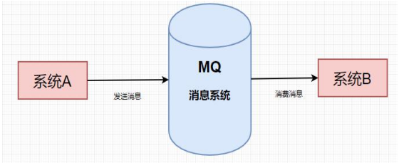

## 一、为什么要使用RabbitMQ
### 1.生活的一个案例：

学生向老师问问题，老师只有一个，学生有多个。这是有多个学生向同一个老师提问，但是老师只能一个一个回答。
这会导致后面的学生等待的时间较长，才能得到老师的解答，而且还不能做其他事情。老师就想了个办法，就是学生把自己要提问的问题
写到纸条上然后做其他事情去， 然后交给老师， 老师收到纸条后，按照顺序一个一个回答学生的问题。这样就避免了学生等待时间过长的问题。

### 2.技术中的案例：

用户注册问题，用户注册后，需要给用户发送邮件，但是用户注册的邮件发送需要一定的时间，如果用户注册的邮件发送时间过长，
假设用户注册了1000个用户，但是用户注册的接口只能一个一个处理，这样会导致用户注册时间过长。

> **提问：用异步线程去发送邮件，而不用rabbitmq不行吗？**
>
> 答：可以的，但是如果用户注册的量非常大，比如一天注册了100万用户，这样异步线程处理的速度可能会跟不上用户注册的速度，
就会导致用户注册的信息堆积，最终可能会导致系统崩溃。

### 3.大型分布式应用中：
系统间的 RPC（远程进程调用） 交互复杂，一个功能后面要调用上百个接口并非不可能，从单机架构过渡到分布式微服务架构，这样的架构会出现阻塞问题，
根据上面的几个问题，在设置系统时可以明确要达到的目标
1. 要做到系统解耦，当新的模块进来时，可以做到代码改动最小; 能够解耦
2. 设置流程缓冲池，可以让后端系统按自身吞吐能力进行消费，不被冲垮; 能够削峰
3. 强弱依赖梳理能把非关键调用链路的操作异步化并提升整体系统的吞吐能力;能够异步

## 二、RabbitMQ的基本概念
### 1. 什么是Rabbitmq

RabbitMQ 是一个开源的消息代理软件（消息中间件） ，实现了高级消息队列协议（AMQP），
用于应用程序之间的消息传递和解耦。

### 2.RabbitMQ运行流程

#### 1.定义

生产者将消息发送到RabbitMQ，RabbitMQ将消息发送到交换机，交换机根据路由键将消息发送到队列，然后消费者从RabbitMQ中获取消息进行处理。

#### 2.核心组件
1. 生产者（Producer）：
   发送消息到 RabbitMQ 服务器的应用程序，应用程序将消息发布到特定的 Exchange。
2. Exchange（交换机）：将生产者发送的消息根据路由规则将消息转发到相应的队列，队列常见类型：Direct、Topic、Fanout、Headers。
3. Binding（绑定）： Exchange 和 Queue 之间的连接关系，定义消息路由规则。
4. Queue（队列）： 存储消息的缓冲区，消息在被消费前临时存储的位置。
5. 消费者（Consumer）： 从队列中接收和处理消息的应用程序，订阅特定队列获取消息。

